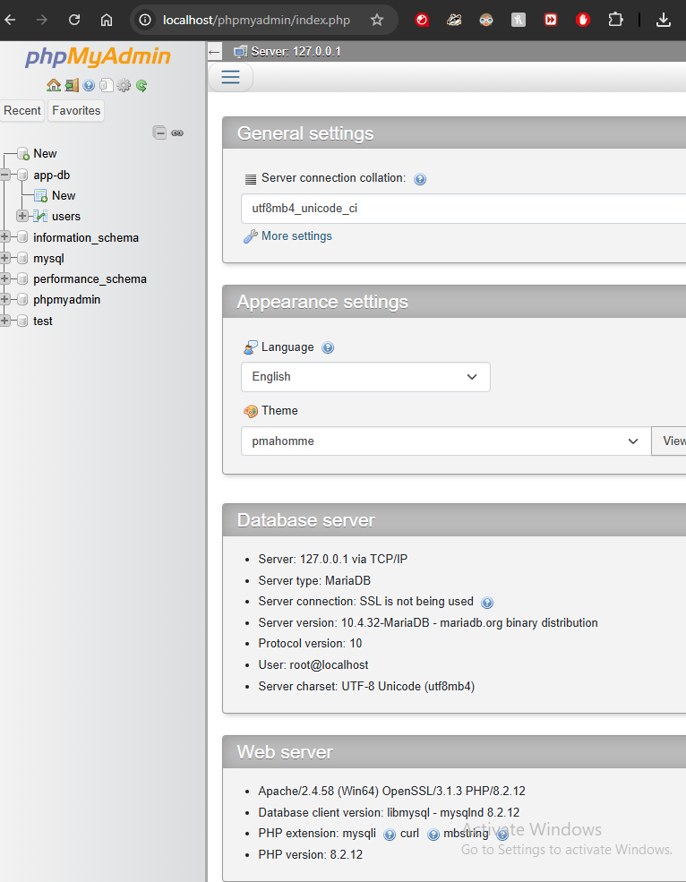
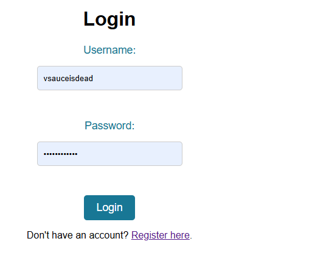
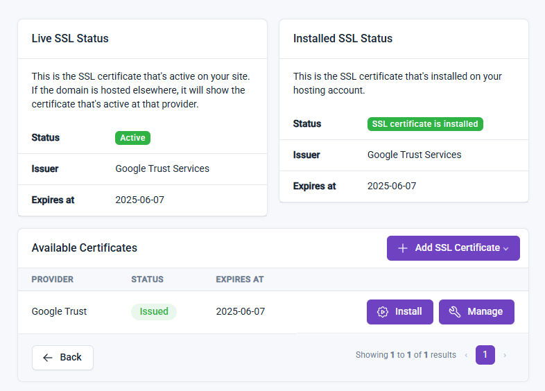
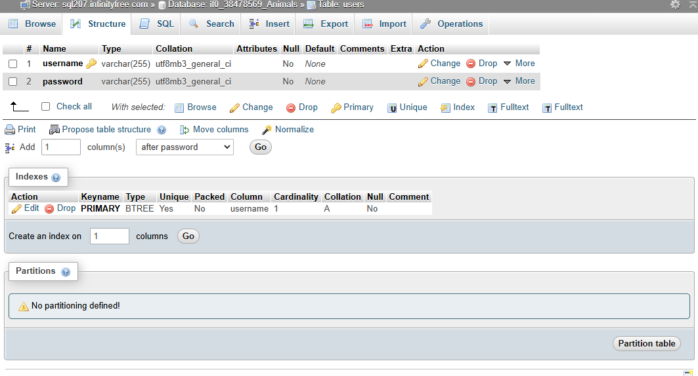

# Landing-Page-Animal-Translator
Animal translator software landing page for software dev assignment. Jaime and I made a project selling a machine that helps talk to animals. We split it down the middle so he got the index file and I got the about file, we split the small requirements and did styling for our own pages. We then collaborated at the end for testing, code review, and submitting. I, Abdu, had troubles with keeping accurate records of the commits and which branch I'm committing from which is definitely a lesson to be learned. I tried to leave small notes to try and make it less confusing. Overall, Jaime did a great job divvying up the workload and split it 50/50 so the work load was split even and we both got to work on the various parts so we'd have a better idea.

---

## Workflow Split

### Jaime’s Responsibilities:
- Create the GitHub repo & add the instructor/TAs.
- Build `index.html` (main landing page).
- Implement ID-based CSS styles & Flexbox.
- Test for mobile responsiveness.
- Review & approve Partner B’s pull request.

### Abdu’s Responsibilities:
- Define project details in the README file.
- Build `about.html` (or second page).
- Implement Class-based CSS styles & navigation styling.
- Run Google Lighthouse tests & optimize scores.
- Review & approve Partner A’s pull request.

### Both:
- Plan the project together.
- Set up GitHub issues & feature branches.
- Validate HTML/CSS & visually inspect site.
- Ensure GitHub Pages deployment is working.
- Confirm the 50/50 split in the README before submission.

---

# CRUD Web Application
Assignment 2 for software dev - Jaime & Abdu - A web application for user authentication and CRUD functionality using PHP and MySQL.

---

## Project Structure
- **css/** - CSS stylesheets
- **js/** - JavaScript files
- **php/** - PHP backend scripts (login, registration, CRUD)
- **sql/** - SQL scripts for database creation
- **images/** - Images and screenshots
- **README.md** - Project documentation and setup instructions

---

## Setup Instructions

### 1. **Install XAMPP:**
   - Download and install [XAMPP](https://www.apachefriends.org/index.html).
   - Start the Apache and MySQL services from the XAMPP Control Panel.

### 2. **Set Up the Database:**
   - Open phpMyAdmin by navigating to `http://localhost/phpmyadmin`.
   - Create a new database called `app-db` using the following SQL query:
     ```sql
     CREATE DATABASE `app-db`;
     ```
   - Create the `users` table using the following SQL query:
     ```sql
     CREATE TABLE `users` (
       `username` VARCHAR(255) NOT NULL,
       `password` VARCHAR(255) NOT NULL,
       PRIMARY KEY (`username`)
     );
     ```


### 3. **Clone the Repository:**
   - Clone this repository to your local machine:
     ```bash
     git clone https://github.com/your-username/your-repo-name.git
     ```
   - Move the project files to the `htdocs` folder in your XAMPP installation directory.

### 4. **Run the App:**
   - Open your browser and navigate to `http://localhost/your-project-folder`.

---

## Database Queries

### SQL Query to Create the Database:
```sql
CREATE DATABASE `app-db`;

SQL Query to Create the Users Table:


CREATE TABLE `users` (
  `username` VARCHAR(255) NOT NULL,
  `password` VARCHAR(255) NOT NULL,
  PRIMARY KEY (`username`)
);

Screenshots


## Screenshots

### 1. phpMyAdmin Interface


### 2. Users Table Structure


### 3. Login Page


### 4. Registration Page


### 5. Software Bought Structure


### 6. Software Bought SQL


### 7. SSL/TLS Certificate


### 8. SUPER SSL


### 9. Users Image



User Authentication and Session Management
Registration:

Users can register by providing a username and password.

Passwords are hashed and salted using PHP's password_hash() function before being stored in the database.

Duplicate usernames are not allowed.

Login:

Users can log in with their username and password.

Passwords are verified using PHP's password_verify() function.

Upon successful login, a session is started using session_start(), and the username is stored in $_SESSION['username'].

Logout:

Users can log out by destroying the session using session_destroy().

Session Management:

Users remain logged in across pages as long as the session is active.

Logged-in users are redirected away from the registration and login pages.

Final Testing
1. User Authentication Flow:
Registration:

Register a new user with a valid username and password.

Try registering with a duplicate username (should display: "Username already exists").

Try registering with mismatched passwords (should display: "Passwords do not match").

Try registering with a password shorter than 10 characters (should display: "Password must be at least 10 characters long").

Login:

Log in with a valid username and password.

Try logging in with an incorrect username or password (should display: "Invalid username or password").

Logout:

Log out and verify that the session is destroyed.

2. Session Management:
Verify that:

Logged-in users stay authenticated across pages.

Logged-in users cannot access the registration or login pages.

The username is displayed at the top of each page when logged in.

3. Collaborate with Partner B:
Ensure that the authentication module integrates seamlessly with Partner B’s CRUD functionality.

Test that:

Only the rightful owner can update or delete their entries.

All users can view data entered by others.

Deployment Instructions
1. Deploy to InfinityFree:
Sign up for a free account at InfinityFree.

Upload your project files to the InfinityFree server using FTP or their file manager.

Set up the database on InfinityFree using the same SQL queries provided above.

2. Set Up SSL/TLS Certificate:
Log in to your InfinityFree account and navigate to the Control Panel.

Click on "SSL/TLS" and follow the instructions to create and deploy a free SSL certificate.

Wait a few minutes for the certificate to activate. You should see a green padlock in the browser's address bar.

Additional Checks
1. SQL Queries Are Parameterized:
All SQL queries use prepared statements to prevent SQL injection.

2. Passwords Are Hashed and Salted:
Passwords are hashed using password_hash() before being stored in the database.

3. Session Management Works:
Users stay logged in across pages.

Sessions are destroyed upon logout.

4. Logged-In Users Cannot Access Registration Page:
Logged-in users are redirected away from the registration page.

5. Error Messages Are Clear and User-Friendly:
All error messages (e.g., duplicate username, incorrect password) are clear and helpful.

Contribution
Jaime: 50%

Abdu: 50%
